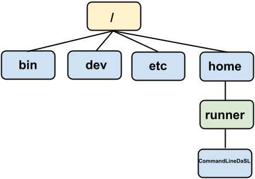

# Command Line Workshop

## What is the Command Line and why should I learn it?

Let's think about the ways we can interact with a computer: keyboard and mouse, hand gestures on a smartphone, voice commands, AR/VR, etc. Most of these interactions are related to a Graphical User Interface (GUI), which centers on the interaction between a pointer and colorful windows and menus.

However, the way a computer interprets and executes instructions are based on text commands. Even graphical information, such as where the mouse is when it clicked a button, is converted into numbers and characters. That means to be an effective programmer and data scientist, we also need to learn how to interact with our computers in a text-based way. This text-based interaction is called the Command Line Interface (CLI).

Examples where we need to use the Command Line:

-   Scalable manipulation of text, files, and folders: if we want to move all files that have the words "tax returns" to a new folder, it would probably not scale easily via a mouse, but it could be done in one command in the Command Line.

-   Use of programming languages and scientific software tools often require Command Line knowledge: running Python and R programs, using Git, alignment and variant calling bioinformatics software. Although there are nice graphical user interfaces such as RStudio, Juypter Notebooks, and Galaxy, to have full flexibility of these languages you need to control them from the Command Line.

-   Use to high performance computing systems and the cloud all require Command Line knowledge as they do not typically offer GUIs.

The most commonly used Command Line is the Shell. The Shell is a dynamic programming environment, similar to R and Python, but focuses on interacting with the operating system.

## Getting Started

In this workshop, we are working on a virtual command line via Posit Cloud. After this workshop, if you want to use the command line locally from your computer, see the appendix.

To access the virtual command line on Posit Cloud, you can access the following project: <https://posit.cloud/content/9696853>

Once you are in, on the left hand side of the screen, click the "Terminal" tab.

You should see some text, ending with a blinking cursor, such as this:

```         
/cloud/project$ 
```

This states that your current directory is `/cloud/project`. This current directory is important: in the Command Line, you interact with the computer from a directory, similar interacting with the computer using a file system window graphically.

Sometimes, the directory path is long so not the full path is printed. To see the path, type in the command `pwd` and hit enter.

```         
/cloud/project$ pwd
/cloud/project
```

Unlike a GUI, the CLI does not provide immediate options to you to interact with. We have to know a learn a handful of vocabulary to interact with it well. But besides the vocabulary, we need to keep a mental model of a task we want to complete. In GUIs that that mental model is shown to us visually, such as a file browser.

We organizes our seminar by constructing several mental models and learning relevant commands related to each model.

## Mental Model 1: Navigating a directory tree

On our computer, the **directory tree** organizes files and directories in an (upside down) tree-like structure. In each folder, there is a parental directory, and there can be files and directories within it. The root directory `/` does not have a parental directory and contains all directories and files in on the computer.

Below is a typical directory tree schematic, with the root directory being `/` and home directory being `/home/runner`. We refer to a particular directory by describing its **directory path** separated by `/` slashes.

{alt="Posit Cloud directory tree"}

To interact with files and programs in the file system in the GUI world, we moved up and down the directory tree via point and clicking on windows. In the CLI world we can use the following commands:

-   `pwd` prints out our current directory.

-   `cd /` changes directory to the root directory.

-   `cd /cloud/project/input_files` changes directory to the directory we started with.

So far, we have changed the directory by specifying the **absolute directory path**, which means specifying the directory from the root directory `/`. Often, we can specify a path by the **relative directory path**, which is a path *relative to our current directory*.

Suppose you want to access the folder `input_files`.

-   The **absolute directory path** specifies the directory from the root directory: `/cloud/project/input_files`
-   The **relative directory path** is a path *relative to our current directory*: if we are currently at `/cloud/project`, the relative path is `input_files` .
-   The symbol `..` specifies the parent directory. If we are currently at `/cloud/project/software`, the relative path is `../input_files`. You go up one directory, then go down to `input_files`.

To find out what files and folders are within your current directory, the `ls` command will list them for you:

```         
/cloud/project$ ls
input_files  output_files  project.Rproj  software
```

It is very common to navigate a directory tree via iterations of `ls` and `cd` on relative paths.

### Exercise: explore the `/cloud/project` folder.

Folders will not have an extension name, but files will, such as `.txt` or `.fastq` ones.

To examine a text file completely, use the `cat` command with the text file name, such as:

```         
/cloud/project/input_files$ cat metadata.txt
metadata goes here.
```

To examine the first few lines of a text file, use the `head` command with the first argument to be the text file name. To examine the last few lines of a text file, use `tail`. To scroll through a text file, use `less`, which opens up a file, and you can use the arrow keys to browse. Then press `q` to quit.

Hint: to save typing, use the `tab` button twice to complete filepaths you don't know existed.

If something looks out of control, hit `Ctrl-C` to stop a running program.

## Mental Model 2: Treat text-based commands as functions

A **function** is a tool that you can use over and over again:

-   It can take in inputs

-   Does something

-   and can give an output.

The commands you have been using, `pwd`, `cd`, `ls`, and `cat` can be viewed as functions:

-   It can take in **input arguments**, **options**

-   Does something

-   and can give an output

For example, let's look at the ways `ls` can be used:

-   With an input argument
    -   `ls /cloud/project`
-   With options
    -   `ls -l`
-   With options and input argument
    -   `ls -l /cloud/project`

### How do we know what options and arguments to use for a command?

Often, there is a `--help` or `-h` option that tells you how to use the software:

```         
ls --help
```

Online resources: <https://explainshell.com/>

### Exercise: options for `ls`

In the `project` folder, try out a bunch of ways to list files and directories using various options of `ls`. Some questions to explore:

-   Can you display all files? This would include files that start with `.`, which are considered "hidden".

-   Can you sort by time (last modified)?

-   Can you show the long format? What does it show?

-   Can you print out the entire project directory tree by using a recursive option?

-   Can you show the size of each file?

-   How can you use multiple options at once?

## File manipulation

Here are some commands that allows you to create, move, copy, and delete files and folders. All of these commands have no output text.

-   `cp [from] [to]` copies a file or folder from the `[from]` path to a `[to]` folder.

-   `mv [from] [to]` moves a file or folder from the `[from]` path to a `[to]` folder.

-   `mkdir [folderPath]` creates a new folder at the path specified by `[folderPath]`.

-   `rm [path]` deletes a file at `[path]`. `rm -r [folder]` deletes a folder and its subcontents. Cannot be undone unless there is a backup system (usually not on personal computers, but available on Fred Hutch's computing cluster.)

There is a another special directory symbol that come up often in copying and moving. If you want to copy a file to the current directory, specify the working directory via `.` For example,

```         
cp my_folder/file.txt .
```

copies the file to the working directory.

Can you explain what I am doing below?

```         
/cloud/project/input_files$ mkdir cases
/cloud/project/input_files$ mkdir controls
/cloud/project/input_files$ cp sample1_case.fastq cases
/cloud/project/input_files$ cp sample5_control.fastq controls
/cloud/project/input_files$ cd control/
/cloud/project/input_files$ ls
sample5_control.fastq
```

### Wildcards to access multiple files

How can I move multiple files at once based on some pattern, such as "case" or "control"?

The `*` wildcard represents zero or more characters of any form. Therefore, `*case*` will specify all files that starts with anything, have the word case in the middle, and ends with anything.

```         
/cloud/project/input_files$ ls -l  *case*
-rw-rw---- 1 r2244204 rstudio-user 1934812 Mar 20 23:24 sample1_case.fastq
-rw-rw---- 1 r2244204 rstudio-user 1934812 Mar 20 23:24 sample2_case.fastq
-rw-rw---- 1 r2244204 rstudio-user 1934812 Mar 20 23:24 sample3_case.fastq
-rw-rw---- 1 r2244204 rstudio-user 1934812 Mar 20 23:24 sample4_case.fastq
```

Similarly, if we want anything that ends in fastq,

```         
/cloud/project/input_files$ ls -l  *fastq
-rw-rw---- 1 r2244204 rstudio-user 1934812 Mar 20 23:24 sample1_case.fastq
-rw-rw---- 1 r2244204 rstudio-user 1934812 Mar 20 23:24 sample2_case.fastq
-rw-rw---- 1 r2244204 rstudio-user 1934812 Mar 20 23:24 sample3_case.fastq
-rw-rw---- 1 r2244204 rstudio-user 1934812 Mar 20 23:24 sample4_case.fastq
-rw-rw---- 1 r2244204 rstudio-user 1934812 Mar 20 23:24 sample5_control.fastq
-rw-rw---- 1 r2244204 rstudio-user 1934812 Mar 20 23:24 sample6_control.fastq
-rw-rw---- 1 r2244204 rstudio-user 1934812 Mar 20 23:24 sample7_control.fastq
```

The input argument for `ls` is now a list of files.

We move it:

```         
/cloud/project/input_files$ cp *case* cases/
```

We can use `*` to specify *all* files in a directory. We delete all files in `cases` (cannot be easily undone!!)

```         
/cloud/project/input_files$ cd cases/
/cloud/project/input_files/cases$ ls
sample1_case.fastq  sample2_case.fastq  sample3_case.fastq  sample4_case.fastq
/cloud/project/input_files/cases$ rm *
```

## Applying what we just learned: running bioinformatics software

A popular DNA sequence alignment tool is called "BWA", and here we present a toy version of it to simulate what it like to use a bioinformatics command line tool. It takes in an unaligned sequence file and a reference genome, and then pretends to align the unaligned sequence to the reference genome.

```         
/cloud/project/input_files$ cd ../software/

/cloud/project/software$ python aligner.py --help
usage: aligner.py [-h] --reference REFERENCE --input INPUT

optional arguments:
  -h, --help            show this help message and exit
  --reference REFERENCE, -r REFERENCE
                        Reference genome file
  --input INPUT, -i INPUT
                        Input fastq file
```

You should use a fastq file from the `input_files` folder and the reference genome file from the `input_files/reference_genome` folder.

If it works, you will get a wall of text ending with something like:

```         
Aligned sequence  9996 :  ATATTAAATTCTAATATCTGGATCCTTTTGTAGTTCATGAGCGTGATGATTGGGTGTTTCACGCATGTGTGTGCAA
Aligned sequence  9997 :  ATTTTCTCTTTTTATTTATTATTTATTGGTTTCATAGAGCTGAGTGGAGTACGAATGTCTTAACTCTGATATCATT
Aligned sequence  9998 :  TGGTCTCCATTCACACCAGCCTCTTGTCACTGCTCTGTTCTTGTCTCTGGCTTAGAGCTACTTCCTGCTATGGTCC
Aligned sequence  9999 :  ATTCTTCCACCTCTGAAAAACCCCTACCCTCACAGACACTCTAGCCCACAGTCCAACCAGTCCCCAGCCCTCTCTG
Aligned sequence  10000 :  ATCTGAGGGGACGAGAGGGTAAGATGATTGATGGAGGGGAAATCCACAGAGCCTCAGGCACCAAATATGTAGCAAA
```

Nice job!

## Redirects and Pipes

The `python aligner.py` command seems pretty messy - it just dumps an aligned sequencing file in your command line console - what do you do with it? If you look at its manual, there is no option or argument to specify an output file name, which is a bit not user-friendly at first.

However, in the CLI world, this is a perfectly normal way to output a result from a program. We simply need to **redirect** that output to a file ourselves. The output of `./bwa mem` and the output of `ls` can be redirected to a file, via the `>` operation:

```         
python aligner.py --reference [reference genome fasta file] --input [unaligned sequences fastq file] > [output file]
```

Remember when we looked at the output of the `ls` command, an emphasis is placed that the files and directories listed are considered the output of the program. We can redirect that output into a file too:

```         
ls > ls_output.txt
```

Another reason why in the CLI world the output is often dumped to the console is that it gives the user an option to **pipe** it to the next program that takes the first program's output as input, using the symbol `|`. This allows the user to chain together several programs together, each performing a modular task. For instance, if we want to align the sequences, and then look at the first few aligned sequences, we can pipe the output of `bwa mem` with `tail`:

```         
python aligner.py --reference [reference genome fasta file] --input [unaligned sequences fastq file] | head
```

and then save it:

```         
python aligner.py --reference [reference genome fasta file] --input [unaligned sequences fastq file] | head > [output file]
```

This encourages the development of modular, flexible programs that can be connected together via pipes and saved via redirecting.

## Appendix: Starting the command line locally on your computer:

### For Mac users

Open up "Terminal" Application in `Applications/Utilities`.

### For Windows users

-   Open Windows Powershell.

-   Type in: `wsl --install -d ubuntu`, and hit enter.

-   You will might be asked to enter a new username and password. You can use the same as you have for your computer.

-   A shell terminal should show up. If it doesn't show up, look in your search bar for "Ubuntu on Windows", and open it.

## Appendix: Special symbols for directories

-   `.` the current directory.

-   `..` the parent directory.

-   `/` the root directory.

-   `~` the home directory.

## Appendix: Using a text editor in CLI

A commonly used task in CLI is to edit text files. `nano`, `vim`, and `emacs` are the three most popular ones, in increasing learning curve but also complexity in the tasks you can perform. The easiest one to use, `nano` is not installed by default in Posit Cloud. If it was installed on your computer, here is how you would use it:

Pick a file of interest, and run `nano [filename]`. You will see a new screen of the filename's contents. You can move around via the letter keys and make edits as needed. On the bottom of the screen are commands you use to manage the file, such as saving, opening, and quitting. The \^ symbol refers to the Control key on your keyboard. To quit, hit Ctrl-x, and you may have to hit y to confirm. You should get comfortable using a text editor in CLI as it is a common task.

## Appendix: Why do we run some programs using `./`?

Sometimes, you run a piece of software within a folder via `./my_program`. Why is that?

When you type in a command, such as `ls` in the command line, the command line looks to see whether the command belongs to a list of commands it knows how to run. This list of approved commands is stored in an environmental variable. We can see it via:

```         
andrew@MGQQR2YQRT9 ~ % echo $PATH
/opt/homebrew/bin:/opt/homebrew/sbin:/usr/local/bin
```

In each folder (using `:` to distinguish folders apart) are the programs to run commands such as `ls`. If we want to run a program that is not in the `$PATH` environmental variable, there could be security issues. For instance, perhaps someone created a program called `ls` that does something bad to your computer, and you run it, thinking that you are running the program `ls` you are familiar with located in the `$PATH` environment variable. Or someone creating a malicious program called `sl` that takes advantages of typos.

To protect that, to run programs not in `$PATH`, we use: `./program_name`. This is a short-form of referring to the current directory `./` and running `program_name`.

For more info, see this [post](https://unix.stackexchange.com/questions/4430/why-do-we-use-dot-slash-to-execute-a-file-in-linux-unix).
