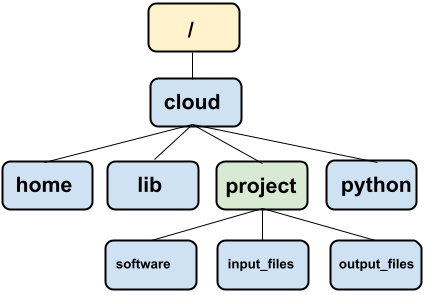

# Command Line Seminar

## What is the Command Line and why should I learn it?

Let's think about the ways we can interact with a computer: keyboard and mouse, hand gestures on a smartphone, voice commands, AR/VR, etc. Most of these interactions are related to a Graphical User Interface (GUI), which centers on the interaction between a pointer and colorful windows and menus.

However, the way a computer interprets and executes instructions are based on text commands. Even graphical information, such as where the mouse is when it clicked a button, is converted into numbers and characters. That means to be an effective programmer and data scientist, we also need to learn how to interact with our computers in a text-based way. This text-based interaction is called the Command Line Interface (CLI).

Examples where we need to use the Command Line:

-   Scalable manipulation of text, files, and folders: if we want to move all files that have the words "tax returns" to a new folder, it would probably not scale easily via a mouse, but it could be done in one command in the Command Line.

-   Use of programming languages and scientific software tools often require Command Line knowledge: running Python and R programs, using Git, alignment and variant calling bioinformatics software. Although there are nice graphical user interfaces such as RStudio, Juypter Notebooks, and Galaxy, to have full flexibility of these languages you need to control them from the Command Line.

-   Use to high performance computing systems and the cloud all require Command Line knowledge as they do not typically offer GUIs.

The most commonly used Command Line is the Shell. The Shell is a dynamic programming environment, similar to R and Python, but focuses on interacting with the operating system.

## Getting Started

Here, we are working in replit's shell. If you want to use the command line locally from your computer, see the appendix.

You should see a single line of text, with a blinking cursor, such as this:

```         
~/project$ 
```

The next piece of character, `~/project` states that the currently directory is `~/project`. The symbol `~` is a short-hand for the "home" directory for the user of a computer. In replit, the home directory is `/home/runner`.

This current directory is important: in the Command Line, you interact with the computer from a directory, similar interacting with the computer using a file system window graphically.

To see the full directory path, type in the command `pwd` and hit enter.

```         
~/project$ pwd
/home/runner/project
```

Unlike a GUI, the CLI does not provide immediate options to you to interact with. We have to know a learn a handful of vocabulary to interact with it well. But besides the vocabulary, we need to keep a mental model of a task we want to complete. In GUIs that that mental model is shown to us visually, such as a file browser.

We organizes our seminar by constructing several mental models and learning relevant commands related to each model.

## Mental Model 1: Navigating a directory tree

On our computer, the **directory tree** organizes files and directories in an (upside down) tree-like structure. In each folder, there is a parental directory, and there can be files and directories within it. The root directory `/` does not have a parental directory and contains all directories and files in on the computer.

Below is a typical directory tree schematic, with the root directory being `/` and home directory being `/home/runner`. We refer to a particular directory by describing its **directory path** separated by `/` slashes.



To interact with files and programs in the file system in the GUI world, we moved up and down the directory tree via point and clicking on windows. In the CLI world we can use the following commands:

-   `pwd` prints out our current directory.

-   `cd /` changes directory to the root directory.

-   `cd /home/runner` changes directory to the home directory.

Consider:

```         
~$ cd /home/runner
~$ pwd
/home/runner
```

So far, we have changed the directory by specifying the **absolute directory path**, which means specifying the directory from the root directory `/`. Often, we can specify a path by the **relative directory path**, which is a path *relative to our current directory*.

Consider:

```         
~$ cd project/
~/project$ pwd
/home/runner/project
~/project$ cd ..
~$ pwd
/home/runner
```

We started in `/home/runner`, and then changed to `/home/runner/project` by specifying `cd project/` as a relative directory path. Finally, we changed the directory to the parent directory of `/home/runner/project` via `cd ..`, back to `/home/runner`. The special directory symbol `..` specifies the parent directory.

How did we know that the `project/` folder is in `/home/runner`? We can list all the files and directories within the current directory:

```         
~$ ls
project
```

It is very common to navigate a directory tree via iterations of `ls` and `cd` on relative paths.

### Exercise: explore the maze.

We will download some files, and let you a more complex file directory:

```         
~/project$ git clone https://github.com/fhdsl/S1_Intro_to_Command_Line.git
Cloning into 'S1_Intro_to_Command_Line'...
remote: Enumerating objects: 844, done.
remote: Counting objects: 100% (571/571), done.
remote: Compressing objects: 100% (319/319), done.
remote: Total 844 (delta 251), reused 465 (delta 209), pack-reused 273
Receiving objects: 100% (844/844), 25.49 MiB | 6.35 MiB/s, done.
Resolving deltas: 100% (280/280), done.
Updating files: 100% (679/679), done.
```

Then,

```         
~/project$ cd S1_Intro_to_Command_Line/cmd_exercises/maze/
~/.../cmd_exercises/maze$ 
```

To examine a text file completely, use the `cat` command with the first argument be the text file name, such as:

```         
andrew@MGQQR2YQRT9 west % cat orca_J.txt 
Pod J
```

To examine the first few lines of a text file, use the `head` command with the first argument to be the text file name. To examine the last few lines of a text file, use `tail`. To scroll through a text file, use `less`, and press `q` to quit.

Hint: to save typing, use the `tab` button twice to complete filepaths you don't know existed.

## Mental Model 2: Treat text-based commands as functions

The commands you have been using, `pwd`, `cd`, `ls`, and `cat` are actually computer programs! They are completely text-based: the program take in some text input, do something with the input, prints out or save something, and quits. There are other text-based programs that are more interactive while it is running, which we will see later: but for now, we will consider this schema for our programs. (We will use programs and commands interchangeably.)

If you have done some programming yourself, you use functions to create programming expressions. A function has a name, takes in inputs, and then does something before optionally returning a output.


Similarly, when using a command from the command line, we should treat it as a function: a command has a *name*, inputs in terms of *options* and/or *arguments*, and optionally *returns* something. See below for an example of running the `ls` command with some options and arguments.


We have been calling `ls` with no argument and options, and it outputs the files and folders in the current working directory.

The command can take an optional argument of a folder path (full or relative), and it outputs the files and folders in that directory:

```         
~/.../cmd_exercises/maze$ ls /
bin  boot  dev  etc  home  inject  io  lib  lib32  lib64  libx32  media  mnt  nix  opt  proc  repl  root  run  sbin  srv  store  sys  tmp  usr  var
```

We add the option `-F`:

```         
~/.../cmd_exercises/maze$ ls -F /
bin@  boot/  dev/  etc/  home/  inject/  io/  lib@  lib32@  lib64@  libx32@  media/  mnt/  nix/  opt/  proc/  repl/  root/  run/  sbin@  srv/  store/  sys/  tmp/  usr/  var/
```

This displays a slash ('/') immediately after each pathname that is a directory, and ('\@') after a symbolic link (not important to know right now).

It is sometimes easy to overlook that the text printed from a command like `ls` is indeed the returned output from the program. It is important to keep this in mind when we start to use multiple commands together later in this seminar.

### Subcommands

Sometimes, a piece of software have many uses, like a swiss army knife. The software might organize its use by using subcommands. For instance, the software `git` has several subcommands such as `git clone`, `git commit`, and so forth. The usual options and arguments follow the subcommand.

### How do we know what options and arguments to use for a command?

Often, there is a `--help` or `-h` option that tells you how to use the software:

```         
ls --help
```

Online resources: <https://explainshell.com/>

### Exercise: options for `ls`

In the maze, try out a bunch of ways to list files and directories using various options of `ls`. Some questions to explore:

-   Can you sort by last modified?

-   Can you show the long format? What is the long format?

-   What are hidden files? Are there any hidden files in the maze? (This requires some googling. The manual is not clear on this.)

-   How can you use multiple options at once?

-   Can you print out the entire maze directory tree by using a recursive option?

## Putting the two mental models together: file manipulation

Here are some commands that allows you to create, move, copy, and delete files and folders. All of these commands have no return value.

-   `cp [from] [to]` copies a file or folder from the `[from]` path to a `[to]` folder.

-   `mv [from] [to]` moves a file or folder from the `[from]` path to a `[to]` folder.

-   `mkdir [folderPath]` creates a new folder at the path specified by `[folderPath]`.

-   `rm [path]` deletes a file at `[path]`. `rm -r [folder]` deletes a folder and its subcontents. Cannot be undone unless there is a backup system (usually not on personal computers, but available on FH's computing cluster.)

There is a another special directory symbol that come up often in copying and moving. If you want to copy a file to the current directory, specify the working directory via `.`. For example,

```         
cp my_folder/file.txt .
```

copies the file to the working directory.

Can you explain what I am doing below?

```         
cmd_exercises % cd maze/west/
clo2@MGQQR2YQRT9 west % ls
clam_1.txt      clam_4.txt      orca_L.txt      seaweed_3.txt       seaweed_6.txt
clam_2.txt      orca_J.txt      seaweed_1.txt       seaweed_4.txt       seaweed_rotten.txt
clam_3.txt      orca_K.txt      seaweed_2.txt       seaweed_5.txt
west % mkdir fish_net
west % mv orca_J.txt fish_net 
west % ls
clam_1.txt      clam_4.txt      orca_L.txt      seaweed_3.txt       seaweed_6.txt
clam_2.txt      fish_net        seaweed_1.txt       seaweed_4.txt       seaweed_rotten.txt
clam_3.txt      orca_K.txt      seaweed_2.txt       seaweed_5.txt
west % ls fish_net 
orca_J.txt
west % cp fish_net/orca_J.txt .
west % ls
clam_1.txt      clam_4.txt      orca_K.txt      seaweed_2.txt       seaweed_5.txt
clam_2.txt      fish_net        orca_L.txt      seaweed_3.txt       seaweed_6.txt
clam_3.txt      orca_J.txt      seaweed_1.txt       seaweed_4.txt       seaweed_rotten.txt
west % ls fish_net 
orca_J.txt
west % rm fish_net/orca_J.txt 
west % rm -r fish_net 
```

### Wildcards to access multiple files

Suppose that I want to move all the files starting with the characters `orca` in the `maze/west` directory. I could run `mv` command multiple times, but that is time consuming if I have a lot of such files. In the Shell, there are special wildcard symbols that allows you to access multiple files of a specific pattern:

The `*` wildcard represents zero or more characters of any form. Therefore, `orca*` will specify all files that have `orca` starting in its file name:

```         
west % ls -l orca*
-rw-r--r--  1 clo2  staff  6 Aug 28 12:56 orca_J.txt
-rw-r--r--  1 clo2  staff  6 Aug 25 15:56 orca_K.txt
-rw-r--r--  1 clo2  staff  6 Aug 25 15:56 orca_L.txt
```

The input argument for `ls` is now a list of files.

We move it:

```         
west % mkdir fish_net
west % mv orca* fish_net 
```

The wildcard can be used in different part of the filename to specify different files:

We can use `*` to specify *all* files in a directory (undoing what we did before):

```         
west % mv fish_net/* .
```

Or just files that have the number 2:

```         
west % ls -l *2*
-rw-r--r--  1 clo2  staff  0 Aug 28 13:21 clam_2.txt
-rw-r--r--  1 clo2  staff  0 Aug 28 13:18 seaweed_2.txt
```

The `?` wildcard represents exactly 1 character of any form:

```         
west % ls -l clam_?.txt
-rw-r--r--  1 clo2  staff  0 Aug 28 13:21 clam_1.txt
-rw-r--r--  1 clo2  staff  0 Aug 28 13:21 clam_2.txt
-rw-r--r--  1 clo2  staff  0 Aug 28 13:21 clam_3.txt
-rw-r--r--  1 clo2  staff  0 Aug 28 13:21 clam_4.txt
```

## Using a text editor in CLI

A commonly used task in CLI is to edit text files. `nano`, `vim`, and `emacs` are the three most popular ones, in increasing learning curve but also complexity in the tasks you can perform. We will start with `nano` today.

Pick a file of interest, and run `nano [filename]`. You will see a new screen of the filename's contents. You can move around via the letter keys and make edits as needed. On the bottom of the screen are commands you use to manage the file, such as saving, opening, and quitting. The \^ symbol refers to the Control key on your keyboard. To quit, hit Ctrl-x, and you may have to hit y to confirm. You should get comfortable using a text editor in CLI as it is a common task.

## Optional: Applying what we just learned: running bioinformatics software

A popular DNA sequence alignment tool is called "BWA", and here we present a toy version of it to simulate what it like to use a bioinformatics command line tool. It takes in an unaligned sequence file and a reference genome, and then pretends to align the unaligned sequence to the reference genome.

0.  Go to `cmd_exercises/bioinformatics/`.

1.  Go to `downloaded_from_sequencing/` and take a look at the `.fastq` file using the commands `cat`, `less`, `head`, and `tail`. This is a high-throughput sequencing file, containing unaligned DNA sequences. Don't worry about that the files don't make sense to you. The point is that you can explore the text files using these commands.

2.  Go to `reference_genome/` and take a look at `miniReference.fasta` using the commands as above. This is a (fake) reference human genome file. We will take the unaligned DNA sequences from the `.fastq` files and figure out where they align in the reference genome.

3.  Go to `bwa_fake/`. Let's align the fastq file to the reference genome!

Look at the documentation of `bwa mem` command to understand what needs to be the input:

```         
./bwa mem --help
```

The appendix explains why we use `./bwa mem` instead of `bwa mem` to run the command.

You should use the files from Steps 1 and 2 to use as the input arguments for alignment.

If it works, you will get a wall of text ending with something like:

```         
Aligned sequence  9996 :  ATATTAAATTCTAATATCTGGATCCTTTTGTAGTTCATGAGCGTGATGATTGGGTGTTTCACGCATGTGTGTGCAA
Aligned sequence  9997 :  ATTTTCTCTTTTTATTTATTATTTATTGGTTTCATAGAGCTGAGTGGAGTACGAATGTCTTAACTCTGATATCATT
Aligned sequence  9998 :  TGGTCTCCATTCACACCAGCCTCTTGTCACTGCTCTGTTCTTGTCTCTGGCTTAGAGCTACTTCCTGCTATGGTCC
Aligned sequence  9999 :  ATTCTTCCACCTCTGAAAAACCCCTACCCTCACAGACACTCTAGCCCACAGTCCAACCAGTCCCCAGCCCTCTCTG
Aligned sequence  10000 :  ATCTGAGGGGACGAGAGGGTAAGATGATTGATGGAGGGGAAATCCACAGAGCCTCAGGCACCAAATATGTAGCAAA
```

Nice job!

## Optional: Redirects and Pipes

The `./bwa mem` command seems pretty messy - it just dumps an aligned sequencing file in your command line console - what do you do with it? If you look at its manual, there is no option or argument to specify an output file name, which is a bit not user-friendly at first.

However, in the CLI world, this is a perfectly normal way to output a result from a program. We simply need to **redirect** that output to a file ourselves. The output of `./bwa mem` and the output of `ls` can be redirected to a file, via the `>` operation:

```         
./bwa mem --ref [reference genome fasta file] --fastq [unaligned sequences fastq file] > [output file]
```

Remember when we looked at the output of the `ls` command, an emphasis is placed that the files and directories listed are considered the output of the program. We can redirect that output into a file too:

```         
ls > ls_output.txt
```

Another reason why in the CLI world the output is often dumped to the console is that it gives the user an option to **pipe** it to the next program that takes the first program's output as input, using the symbol `|`. This allows the user to chain together several programs together, each performing a modular task. For instance, if we want to align the sequences, and then look at the first few aligned sequences, we can pipe the output of `bwa mem` with `tail`:

```         
./bwa mem --ref [reference genome fasta file] --fastq [unaligned sequences fastq file] | head
```

and then save it:

```         
./bwa mem --ref [reference genome fasta file] --fastq [unaligned sequences fastq file] | head > [output file]
```

This encourages the development of modular, flexible programs that can be connected together via pipes and saved via redirecting.

## Appendix: Starting the command line locally on your comptuer:

### For Mac users

Open up "Terminal" Application.

### For Windows users

-   Open Windows Powershell.

-   Type in: `wsl --install -d ubuntu`, and hit enter.

-   You will might be asked to enter a new username and password. You can use the same as you have for your computer.

-   A shell terminal should show up. If it doesn't show up, look in your search bar for "Ubuntu on Windows", and open it.

## Appendix: Special symbols for directories:

-   `.` the current directory.

-   `..` the parent directory.

-   `/` the root directory.

-   `~` the home directory.

## Appendix: Why do we run some programs using `./`?

When you type in a command, such as `ls` in the command line, the command line looks to see whether the command belongs to a list of commands it knows how to run. This list of approved commands is stored in an environmental variable. We can see it via:

```         
andrew@MGQQR2YQRT9 ~ % echo $PATH
/opt/homebrew/bin:/opt/homebrew/sbin:/usr/local/bin
```

In each folder (using `:` to distinguish folders apart) are the programs to run commands such as `ls`. If we want to run a program that is not in the `$PATH` environmental variable, there could be security issues. For instance, perhaps someone created a program called `ls` that does something bad to your computer, and you run it, thinking that you are running the program `ls` you are familiar with located in the `$PATH` environment variable. Or someone creating a malicious program called `sl` that takes advantages of typos.

To protect that, to run programs not in `$PATH`, we use: `./program_name`. This is a short-form of referring to the current directory `./` and running `program_name`.

For more info, see this [post](https://unix.stackexchange.com/questions/4430/why-do-we-use-dot-slash-to-execute-a-file-in-linux-unix).
