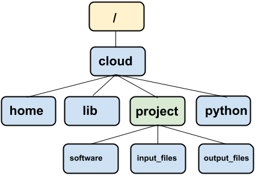

## Welcome!

.png)

Please [sign-up for an account at Posit Cloud](#0 "https://login.posit.cloud/register") and accept our classroom invitation here: <https://posit.cloud/spaces/777756/join?access_code=X20Q5p3F8J_2FH8hUPGn5w9Sz3pJ8eULqp3Kw0cz>

## Introductions

. . .

-   Who am I?

. . .

-   What is [DaSL](https://hutchdatascience.org/) / [OCDO](https://ocdo.fredhutch.org/) ?

. . .

-   Who are you?

    -   Name, pronouns, group you work in

    -   What you want to get out of the workshop

## Goals of the workshop

. . .

-   Understand the purpose of Command Line Interface vs. Graphical User Interface

. . .

-   Be able to navigate a directory tree
-   Be able to create, delete, copy, and move files

. . .

-   Analyze the components of a shell command: what are the possible inputs, options, and outputs, and where to find documentation for help.

. . .

-   Apply what we learned to a demo: bioinformatics tool

## Ways we can interact with a computer:

. . .

-   Graphical User Interface (GUI): interaction between a pointer with windows and menus

. . .

-   Command Line Interface (CLI): text-based interaction

. . .

When is one more effective than the other?

::: notes
Let's think about the ways we can interact with a computer: keyboard and mouse, hand gestures on a smartphone, voice commands, AR/VR, etc. Most of these interactions are related to a Graphical User Interface (GUI), which centers on the interaction between a pointer and colorful windows and menus.

However, the way a computer interprets and executes instructions are based on text commands. Even graphical information, such as where the mouse is when it clicked a button, is converted into numbers and characters. That means to be an effective programmer and data scientist, we also need to learn how to interact with our computers in a text-based way. This text-based interaction is called the Command Line Interface (CLI).
:::

## Common command line usage examples

. . .

-   Scalable manipulation of text, files, and folders

. . .

-   Use of programming languages and scientific software tools

. . .

-   Use to high performance cluster computing systems and the cloud

::: notes
-   Scalable manipulation of text, files, and folders: if we want to move all files that have the words "tax returns" to a new folder, it would probably not scale easily via a mouse, but it could be done in one command in the Command Line.

-   Use of programming languages and scientific software tools often require Command Line knowledge: running Python and R programs, using Git, alignment and variant calling bioinformatics software. Although there are nice graphical user interfaces such as RStudio, Juypter Notebooks, and Galaxy, to have full flexibility of these languages you need to control them from the Command Line.

-   Use to high performance computing systems and the cloud all require Command Line knowledge as they do not typically offer GUIs.
:::

## Getting started

We will be using Posit Cloud, a online coding interface for R, but it has a built-in Command Line.

-   Go to the project: <https://posit.cloud/spaces/777756/join?access_code=X20Q5p3F8J_2FH8hUPGn5w9Sz3pJ8eULqp3Kw0cz>
    -   Create an account or sign-in.
-   Open "Intro_to_Command_Line_practice"
-   Click on the "Terminal" tab.

## Interacting with the command line, a perspective

. . .

-   Unlike a GUI, the CLI does not provide immediate options to you to interact with.

. . .

-   Therefore, we need to keep a mental model of a task we want to complete.

. . .

-   It is (mostly) forgiving, and encourages exploration and experimentation.

::: notes
Unlike a GUI, the CLI does not provide immediate options to you to interact with. We have to know a learn a handful of vocabulary to interact with it well. But besides the vocabulary, we need to keep a mental model of a task we want to complete. In GUIs that that mental model is shown to us visually, such as a file browser.

We organizes our seminar by constructing several mental models and learning relevant commands related to each model.

Lastly, the CLI is forgiving. It will tell you if you did something you did not intend to, with little consequences, which encourages exploration and experimentation. Consequential actions have security safeguards. With this mindset, we will explore the CLI openly.
:::

## Mental Model 1: Navigating a directory tree

. . .

On our computer, the **directory tree** organizes files and directories in an (upside down) tree-like structure. In each folder, there is a parental directory, and there can be files and directories within it.



## Basic directory tree navigation

. . .


. . .

-   `pwd` prints out our current directory.

. . .

-   `cd /` changes directory to the root directory.

. . .

-   `cd /cloud/project` is where we started.

## Absolute vs. relative paths

{alt="Posit Cloud directory tree"}

Suppose you want to access the folder `input_files`.

. . .

-   The **absolute directory path** specifies the directory from the root directory: `/cloud/project/input_files`

. . .

-   The **relative directory path** is a path *relative to our current directory*: if we are currently at `/cloud/project`, the relative path is `input_files` .

. . .

-   The symbol `..` specifies the parent directory. If we are currently at `/cloud/project/software`, the relative path is `../input_files`.

. . .

-   `ls` lists all the files in the current directory.

## Exercise: explore the `project` folder

Use `cd` and `ls` to explore `/cloud/project`

. . .

Commands to look at text files:

-   `cat [filename]` prints out the entire text file.

-   `less [filename]` opens up the text file in a separate screen to explore. Press `q` to quit.

-   `head [filename]` prints out the first few lines of the text file.

-   `tail [filename]` prints out the last few lines of the text file.

. . .

Hit `Ctrl-C` to stop a running program.

## Mental Model 2: Treat commands as functions

A **function** is a tool that you can use over and over again:

-   It can take in inputs

-   Does something

-   and can give an output.

. . .

The commands you have been using, `pwd`, `cd`, `ls`, and `cat` can be viewed as functions.

-   It can take in **input arguments**, **options**

-   Does something

-   and can give an output

## `ls` example

. . .

A command's usage can have any of the following combination:

-   Input argument
    -   `ls /cloud/project`

. . .

-   Options
    -   `ls -l`

. . .

-   Options with input argument
    -   `ls -l /cloud/project`

. . .

## Multiple input arguments

`sh my_script.sh –i my_input.txt -o my_output.txt`

## What are the possible options and arguments for a command?

. . .

There is often `--help` or `-h` option that tells you how to use the software.

```         
ls --help
```

. . .

Online resources: <https://explainshell.com/>

## Exercise: options for `ls`

In the `project` folder, try out a bunch of ways to list files and directories using various options of `ls`. Some questions to explore:

-   Can you display all files? This would include files that start with `.`, which are considered "hidden".

-   Can you sort by time (last modified)?

-   Can you show the long format? What does it show?

-   Can you print out the entire project directory tree by using a recursive option?

-   Can you show the size of each file?

-   How can you use multiple options at once?

## File permissions

If we run `ls -l` (long option) at `/cloud/project`, we see the following:

```         
/cloud/project$ ls -l
total 16
drwxrwx--- 6 r2244204 rstudio-user 4096 Sep 25  2025 input_files
drwxrwx--- 3 r2244204 rstudio-user 4096 Oct  1  2024 output_files
-rw-rw-r-- 1 r2244204 rstudio-user  205 Apr 17 20:08 project.Rproj
drwxrwx--- 2 r2244204 rstudio-user 4096 Sep 25  2025 software
```

What's all this information? We will focus on the first mysterious chunk of text.

## File permissions

What can you do with files?

| Type    | Description                             | Abbreviation | Example                                |
|---------------|--------------------|----------------------|---------------|
| Read    | Level can only read contents of file    | `r`          | A list of users in a text file         |
| Write   | Level can write to the file             | `w`          | Appending an entry to the end of a log |
| Execute | Level can run the file as an executable | `x`          | samtools                               |

. . .

These types of actions have varying levels of permissions that can be set.

| Level       | Description           |
|-------------|-----------------------|
| Owner-level | The owner of the file |
| Group-level | The group of the file |
| Everyone    | The rest of the world |


## File permissions

It's this first part that we want to examine:

```         
folder everyone_else
|      |     
-rw-rw----
 |  |
 you group
```

The 2nd to 4th letters define your own access to the files. The

```         
rw-
```

Means that you have **r**ead and **w**rite access. If we had the following:

```         
rwx
```

That would mean we have read, write, and e**x**ecute access.

[More info here](https://www.redhat.com/en/blog/linux-file-permissions-explained).

## File manipulation

. . .

Here are some commands that allows you to create, move, copy, and delete files and folders. All of these commands have no return value.

-   `cp [from] [to]` copies a file or folder from the `[from]` path to a `[to]` folder.

-   `mv [from] [to]` moves a file or folder from the `[from]` path to a `[to]` folder.

-   `mkdir [folderPath]` creates a new folder at the path specified by `[folderPath]`.

-   `rm [path]` deletes a file at `[path]`. `rm -r [folder]` deletes a folder and its subcontents. Cannot be undone! 😱

## Demo

. . .

-   `*` wildcard

## Running software in CLI

Putting it all together, let's run a (fake) software that aligns sequencing reads to the reference genome.

. . .

```         
~/CommandLineDaSL/project$ cd software/
~/.../project/software$ python aligner.py --help
usage: aligner.py [-h] --reference REFERENCE --input INPUT

options:
  -h, --help            show this help message and exit
  --reference REFERENCE, -r REFERENCE
                        Reference genome file
  --input INPUT, -i INPUT
                        Input fastq file
```

You should use a fastq file from the `input_files` folder and the reference genome file from the `input_files/reference_genome` folder.

## Redirect and Pipes

The `python aligner.py` command seems pretty messy - it just dumps an aligned sequencing file in your command line console - what do you do with it?

. . .

-   Redirect the output to a file: `python aligner.py --reference [reference genome fasta file] --input [unaligned sequences fastq file] > [output file]`

. . .

-   Pipe the output into the next command: `python aligner.py --reference [reference genome fasta file] --input [unaligned sequences fastq file] | head`

## Accessing the Command Line on your computer

-   Macs: `/Applications/Utilities/Terminal.app`

-   Windows: Powershell or Windows Command Prompt gives a *different* flavor of the command line. To use the Unix command line, [install Windows Subsystem for Linux](https://learn.microsoft.com/en-us/windows/wsl/install).

## Continue learning from us!

-   Next week: Intro to Fred Hutch Computing Cluster registration: <https://forms.gle/KEAExryWtC6mjaH8A>

-   The following week: Bash for Bioinformatics registration: <https://forms.gle/4uepLpVXg2yE3xwT7>

-   DaSL/OCDO Data House Calls: <https://ocdo.fredhutch.org/programs/dhc.html>

## Exit survey

<https://forms.gle/JHyidutjXqreTdWa6>
